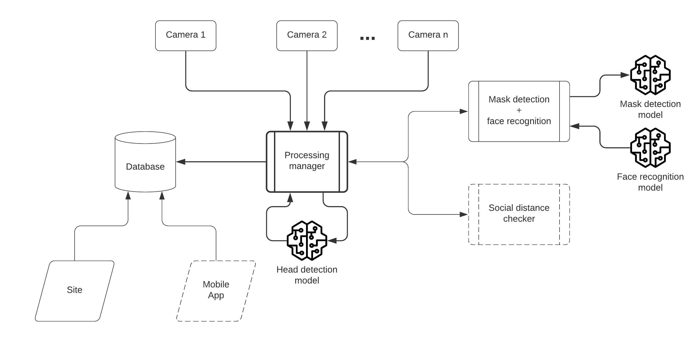
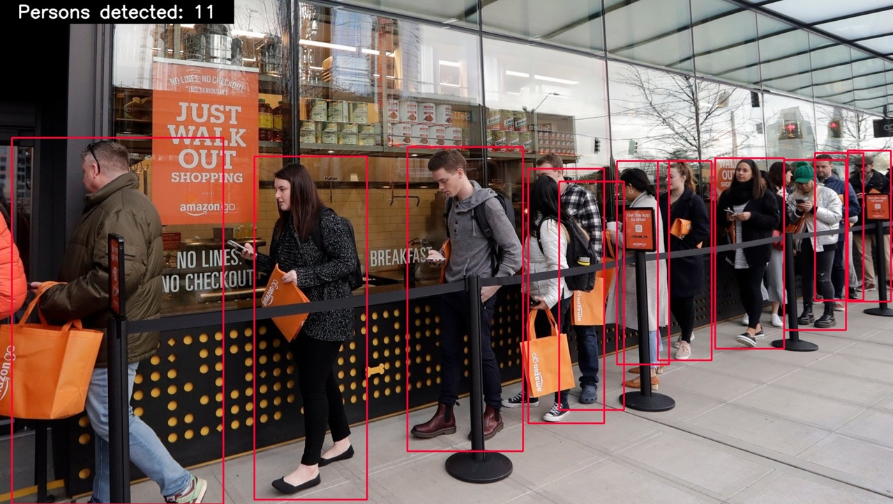
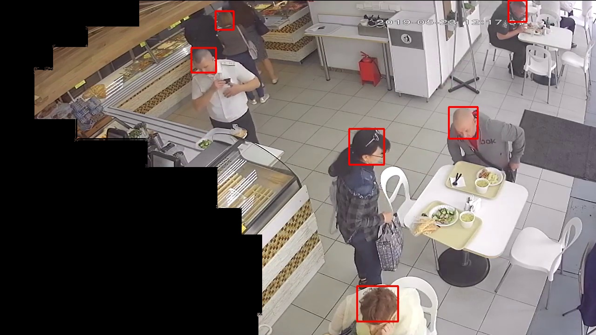
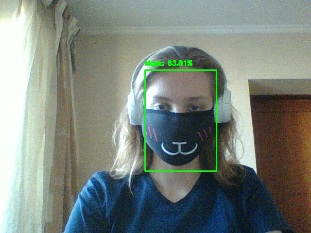
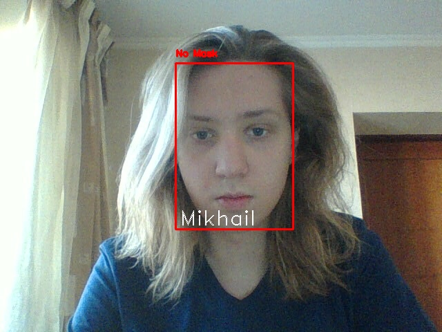
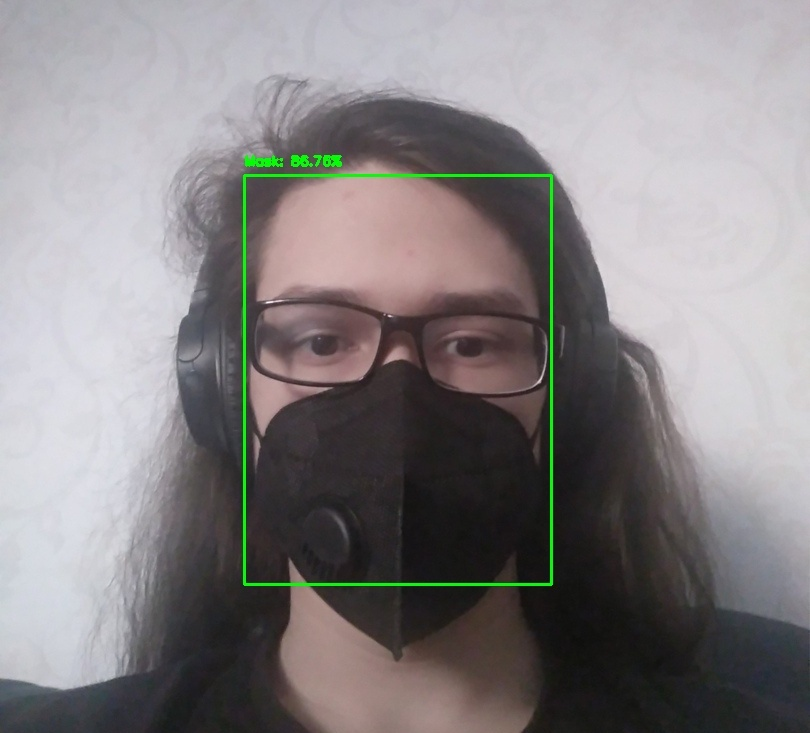
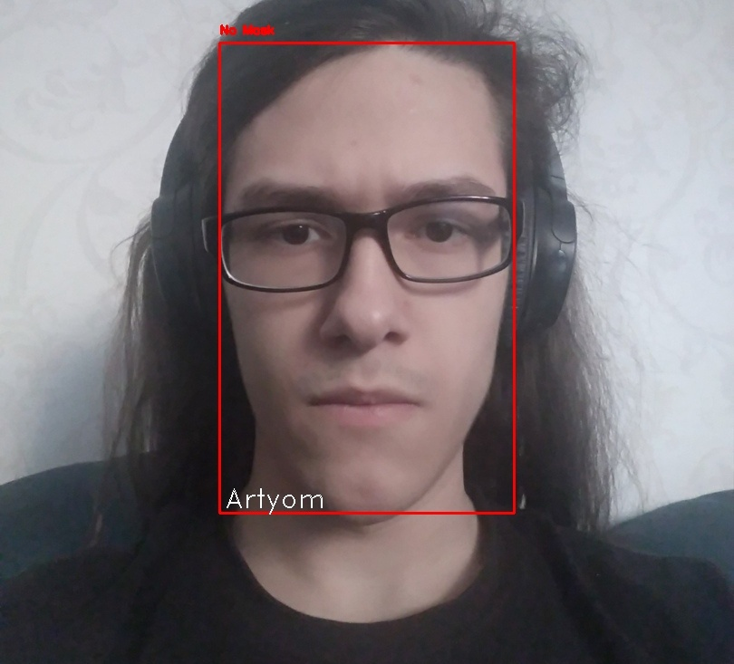

# queue_analysis

System for queue detection and control

## Motivation

This project is the open source solution for queue analysis for people counting.

## TechStack

- [OpenCV](https://opencv.org/)
- [Pytorch head detector implementation](https://github.com/aditya-vora/FCHD-Fully-Convolutional-Head-Detector)
- [Flask for backend](https://flask.palletsprojects.com/en/1.1.x/)
- [SQLite DB](https://www.sqlite.org/)

Scheme of system is illustrated below

## Solution

Firstly person detector was based on full body detector.

But this approach was not so effective. So it was replaced by head detector, which is not so sensitive for overlapping. Also masks were added in order to hide useless for detecting zone and prevent false positive detection. Example can be seen below.

## Advanced functionality

Also functionality of system can be extended due to the system flexibility. As represented above, mask detection + face recognition system can be added for COVID-19 situation control monitoring.

